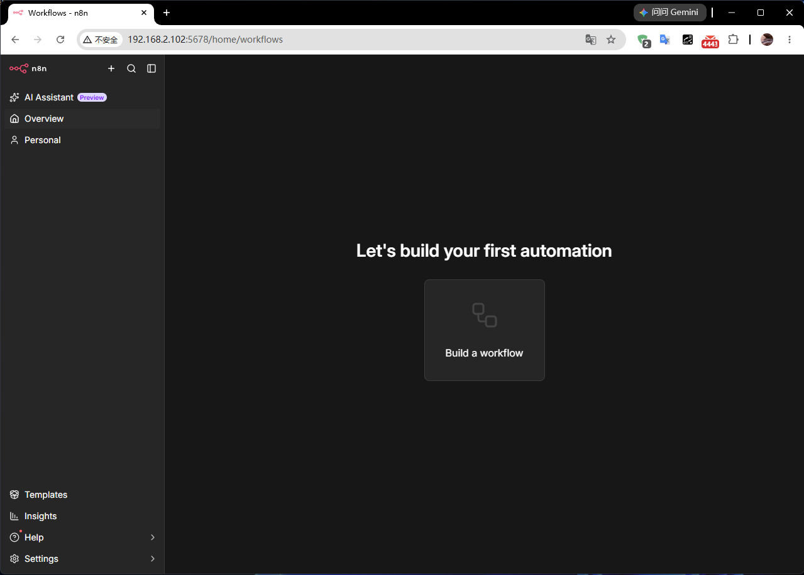
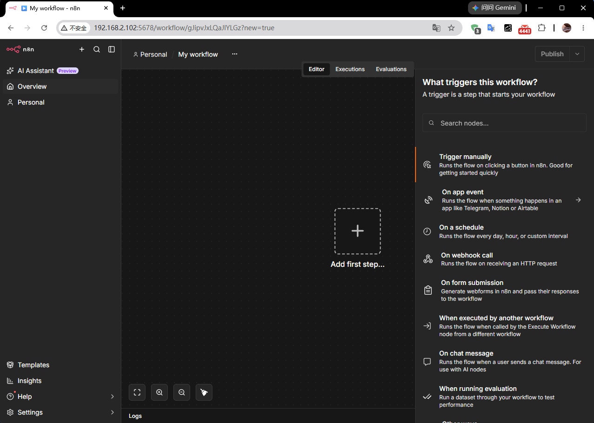
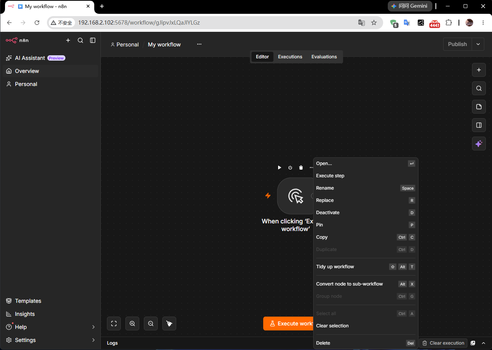
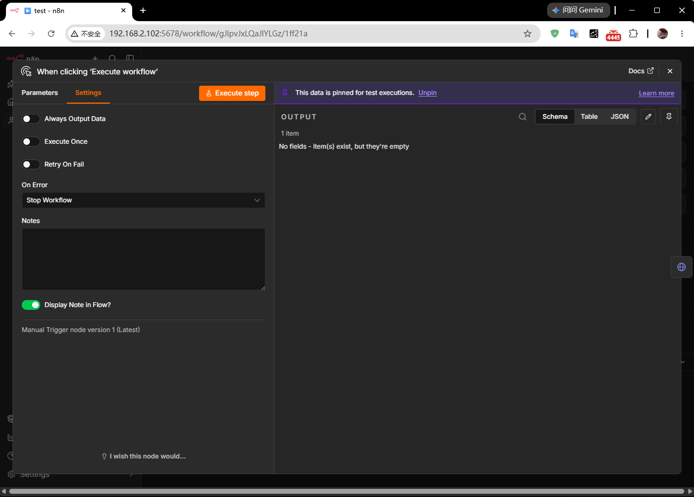
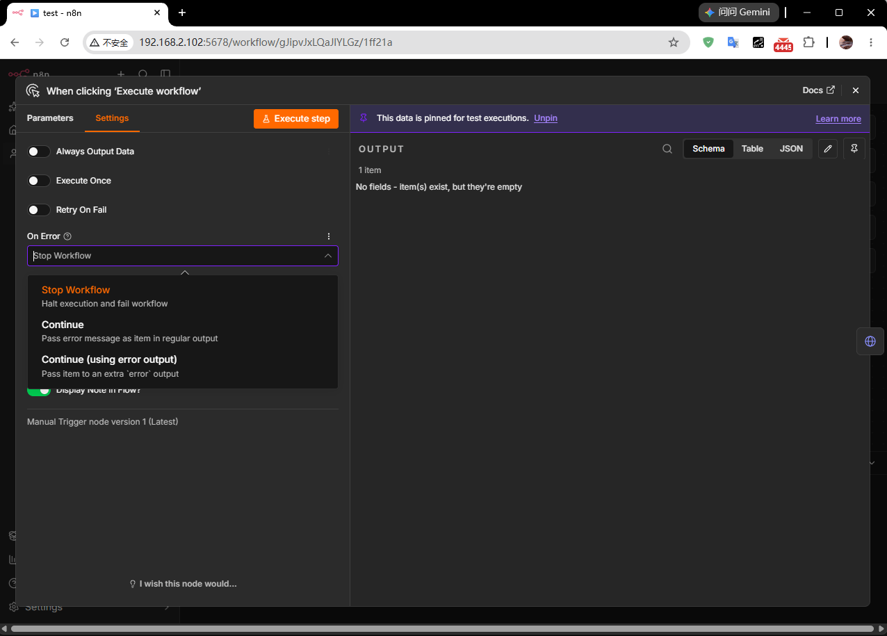

# 了解工作流程
<show-structure for="chapter,procedure"/>

> 工作流是由多个节点连接而成的，用于自动化某个流程。

## 工作流组件

工作流组件包含：

- Nodes（节点）: integrations and operations.（集成和操作）
- Connections（连接）: node connectors.（节点连接器）
- Sticky notes（便签）: document your workflows.（记录你的工作流程）
- Canvas Groups（画布组）: organize related nodes.（组织相关节点）

### Nodes 节点

节点是工作流的关键组成部分。它们执行一系列操作，包括：

- 启动工作流程
- 获取和发送数据
- 数据处理和操作

n8n 提供了一系列内置节点，同时也支持创建自定义节点。请参阅：

- [内置集成功能](https://docs.n8n.io/integrations/builtin/node-types)，可浏览节点库。
- [社区节点](https://docs.n8n.io/integrations/community-nodes/installation-and-management)，用于指导如何查找和安装社区创建的节点。
- [创建节点](https://docs.n8n.io/connect/create-nodes/overview)以开始构建您自己的节点。

#### 向工作流程中添加节点

##### 向空工作流程添加节点

- `Overview`菜单中点击`Build a workflow`
  {thumbnail="true"}

- `Personal`选择`Workflows`，然后点击`Create workflow`
  {thumbnail="true"}

- 点击`Add first step…`，可查看所有类型的触发器
  {thumbnail="true"}

> 如果您选择“应用事件触发”，n8n 将显示所有受支持服务的列表。您可以使用此列表浏览 n8n
> 的集成，并根据所选服务中的事件触发工作流。并非所有集成都支持触发器。要查看哪些集成可以用作触发器，请选择相应的节点。如果某个集成支持触发器，您将在可用操作列表的顶部看到它。

{thumbnail="true"}

##### 节点操作：触发器和动作

在工作流中添加节点时，n8n 会显示可用操作列表。操作是指节点执行的操作，例如获取或发送数据。

操作分为两种类型：

- 触发器会在服务中发生特定事件或满足特定条件时启动工作流。选择触发器后，n8n 会向工作流中添加一个触发节点，并预先选中您选择的触发操作。在
  n8n 中搜索节点时，触发操作会显示一个闪电图标触发图标。

- 操作是指工作流中的特定任务，可用于处理数据、对外部系统执行操作以及触发其他系统中的事件。选择操作后，n8n
  会向工作流中添加一个节点，并预先选中您选择的操作。

##### 节点控制

要查看节点控件，请将鼠标悬停在画布上的节点上。

- Execute step Execute
  step
  执行步骤:
  Run the node.运行节点
- Deactivate Deactivate
  node
  停用:
  Deactivate the node.停用该节点
- Delete Delete
  node
  删除:
  Delete the node.删除节点

+ Node context menu Node context
  menu
  节点上下文菜单:
  Select node actions.选择节点操作 Available actions可用操作:

    - Open node 打开节点
    - Execute step 执行步骤
    - Rename node 重命名节点
    - Deactivate node 停用节点
    - Pin node 固定节点
    - Copy node 复制节点
    - Duplicate node 重复节点
    - Tidy up workflow 整理工作流程
    - Convert node to sub-workflow 将节点转换为子工作流
    - Select all 全选
    - Clear selection 清除选择
    - Delete node 删除节点

{thumbnail="true"}

##### 节点设置

鼠标双击节点，在弹出页面“设置”选项卡下的节点设置中，您可以控制节点行为并添加节点注释。

启用或设置后，它们会执行以下操作：

- Always Output Data始终输出数据：即使节点在执行过程中没有返回任何数据，该节点也会返回一个空项。请谨慎在 IF
  节点上设置此选项，因为它可能会导致无限循环。
- Execute Once仅执行一次：该节点仅执行一次，处理接收到的第一项数据。它不会处理任何其他数据项。
- Retry On Fail失败时重试：当执行失败时，节点会重新运行，直到成功为止。

+ On Error出错时：
    - Stop Workflow停止工作流：当发生错误时，停止整个工作流，阻止进一步的节点执行。
    - Continue 继续：即使出现错误，也继续执行下一个节点，使用最后一个有效数据。
    - Continue (using error output)继续（使用错误输出）：继续执行工作流，并将错误信息传递给下一个节点进行处理。

Custom Span Attributes自定义 Span 属性：向节点的 OpenTelemetry Span 添加自定义键值属性。键为纯文本，值支持表达式。此设置仅在启用
OpenTelemetry 跟踪并拥有自托管企业版许可证时才会显示。有关详细信息，请参阅“自定义 Span 属性”。

您可以使用节点注释来记录您的工作流程：

- Notes 注释：请注意与节点一起保存。
- Display note in flow 在流程中显示注释：如果启用，n8n 会在工作流程中将注释显示为副标题。

{thumbnail="true"}
{thumbnail="true"}

### Connect nodes 连接节点

### Canvas Groups 画布组

### Sticky notes 便签

## 执行过程

## 创建并运行工作流

## 保存并发布公工作流程

## 创建和编辑凭据
