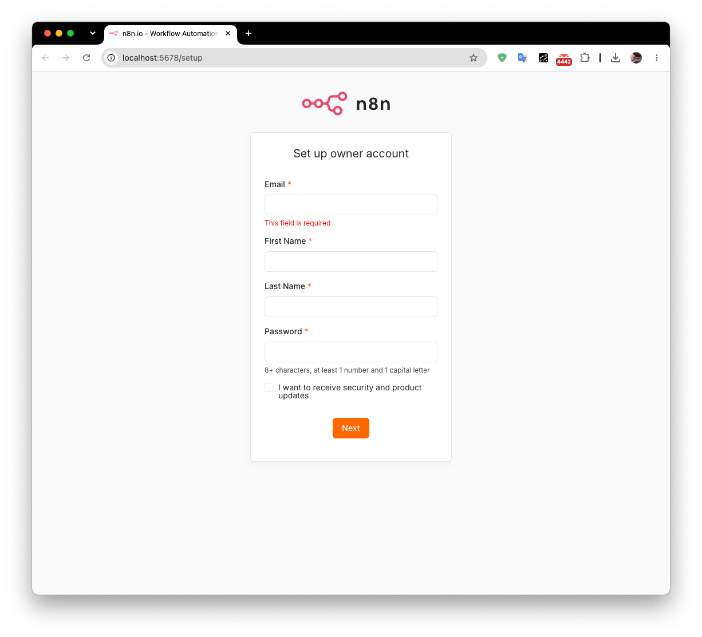

# 部署n8n

## docker
部署命令如下：

```Bash
docker run -it --rm \
 --name n8n \
 -p 5678:5678 \
 -v n8n_data:/home/node/.n8n \
 docker.n8n.io/n8nio/n8n \
 start --tunnel
```

访问路径：http://localhost:5678/setup

{ thumbnail="true" }

## 使用npm安装
>从 n8n 3.0 开始，基于 npm 的安装方式已被弃用。

