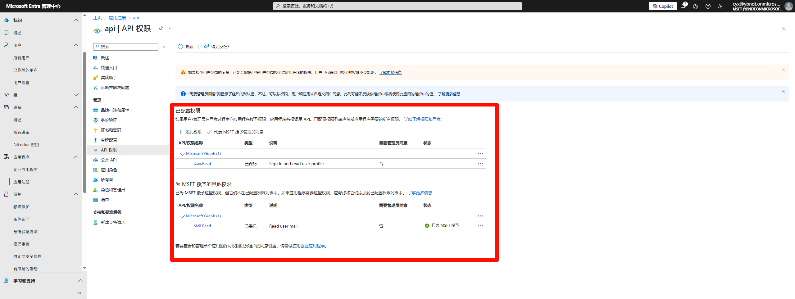

# OAuth 2.0

## 链接

[Microsoft Entra 管理中心](https://entra.microsoft.com/#home)

## OAuth 2.0 身份验证代码授予

### 请求授权代码

1、 注册应用
{ thumbnail="true" }

2、身份验证
{ thumbnail="true" }

3、API权限
{ thumbnail="true" }

4、浏览器请求url
{ thumbnail="true" }
{ thumbnail="true" }

### 使用 client_secret 请求访问令牌

{ thumbnail="true" }

- code 为`请求授权代码`中的`浏览器请求url` 取值。
  { thumbnail="true" }
