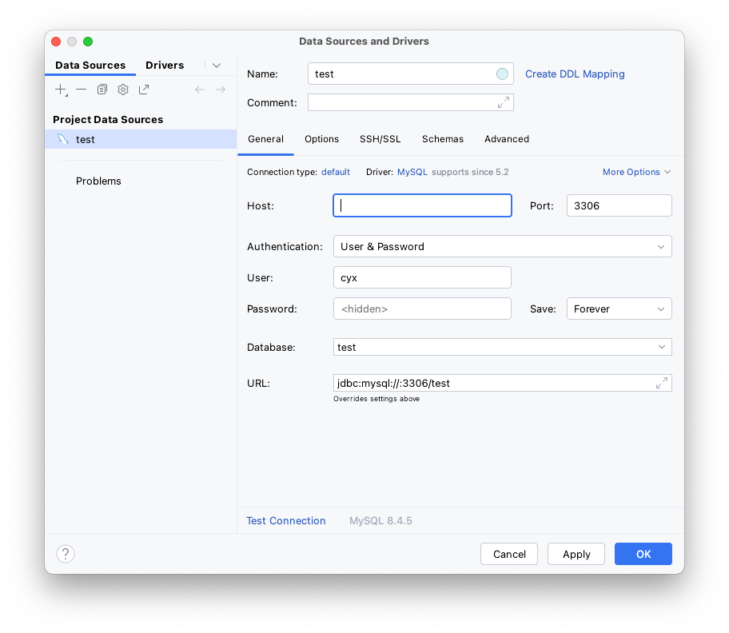

# MySql连接

## Linux
命令行登录：

```bash
ubuntu@VM-4-12-ubuntu:~$ docker exec -it mysql bash
bash-5.1# mysql -u root -p
Enter password:
Welcome to the MySQL monitor.  Commands end with ; or \g.
Your MySQL connection id is 10
Server version: 8.4.5 MySQL Community Server - GPL

Copyright (c) 2000, 2025, Oracle and/or its affiliates.

Oracle is a registered trademark of Oracle Corporation and/or its
affiliates. Other names may be trademarks of their respective
owners.

Type 'help;' or '\h' for help. Type '\c' to clear the current input statement.

mysql>ubuntu@VM-4-12-ubuntu:~$ docker exec -it mysql bash
bash-5.1# mysql -u root -p
Enter password:
Welcome to the MySQL monitor.  Commands end with ; or \g.
Your MySQL connection id is 10
Server version: 8.4.5 MySQL Community Server - GPL

Copyright (c) 2000, 2025, Oracle and/or its affiliates.

Oracle is a registered trademark of Oracle Corporation and/or its
affiliates. Other names may be trademarks of their respective
owners.

Type 'help;' or '\h' for help. Type '\c' to clear the current input statement.

mysql>
```

格式如下：
```Bash
mysql -u your_username -p
参数说明：
-u 参数用于指定用户名。
-p 参数表示需要输入密码。
指定主机和端口连接（适用于远程连接）:
mysql -h 主机名或IP地址 -P 端口号 -u 用户名 -p
```

## 数据库工具
{ thumbnail="true" }