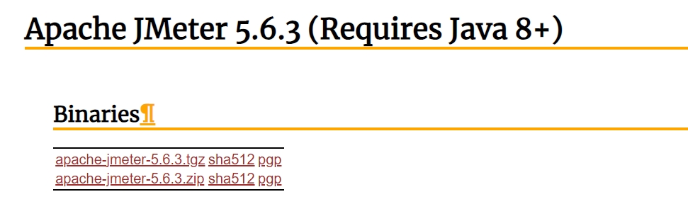

# 1. Jmeter安装
## 1.1. Windows
### 1.1.1. Windows JDK
[jdk8](https://www.oracle.com/webapps/redirect/signon?nexturl=https://download.oracle.com/otn/java/jdk/8u391-b13/b291ca3e0c8548b5a51d5a5f50063037/jdk-8u391-windows-x64.exe)

### 1.1.2. 安装
双击安装

### 1.1.3. 配置环境变量
鼠标右键`我的电脑`→`属性`→`高级系统设置`→`环境变量`→`系统变量`→`新建`。


     
在`系统变量`的`path`中添加 `%JAVA_HOME%\bin`、 `%JAVA_HOME%\jre\bin`。

### 1.1.4. 验证
如下图所示：


## 1.2. Jmeter
### 1.2.1. 下载
[Apache JMeter 5.6.3 (Requires Java 8+)](https://jmeter.apache.org/download_jmeter.cgi)



### 1.2.2. 解压
解压下载的压缩包

### 1.2.3. 环境变量配置
- 新建变量名：`JMETER_HOME`，变量值：`D:\apache-jmeter-5.6.3`，`D:\apache-jmeter-5.6.3`为Jmeter解压自定义路径。
- `Path`新建环境变量`D:\apache-jmeter-5.6.3\bin`，`D:\apache-jmeter-5.6.3\bin`为Jmeter解压自定义路径下bin目录路径。

### 1.2.4. 启动
#### 1.2.4.1. cmd
```shell
Microsoft Windows [版本 10.0.17763.5696]
(c) 2018 Microsoft Corporation。保留所有权利。

C:\Users\Razer>jmeter
WARN StatusConsoleListener The use of package scanning to locate plugins is deprecated and will be removed in a future release
WARN StatusConsoleListener The use of package scanning to locate plugins is deprecated and will be removed in a future release
WARN StatusConsoleListener The use of package scanning to locate plugins is deprecated and will be removed in a future release
WARN StatusConsoleListener The use of package scanning to locate plugins is deprecated and will be removed in a future release
================================================================================
Don't use GUI mode for load testing !, only for Test creation and Test debugging.
For load testing, use CLI Mode (was NON GUI):
   jmeter -n -t [jmx file] -l [results file] -e -o [Path to web report folder]
& increase Java Heap to meet your test requirements:
   Modify current env variable HEAP="-Xms1g -Xmx1g -XX:MaxMetaspaceSize=256m" in the jmeter batch file
Check : https://jmeter.apache.org/usermanual/best-practices.html
================================================================================
```

#### 1.2.4.2. 脚本
路径：`D:\apache-jmeter-5.6.3\bin\jmeter.bat`，`D:\apache-jmeter-5.6.3`为Jmeter解压后的自定义路径。