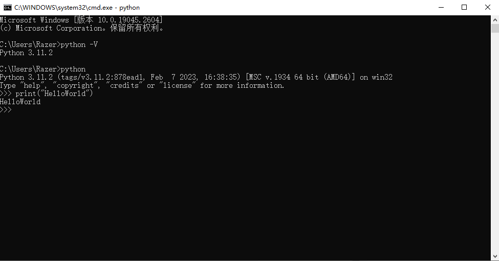
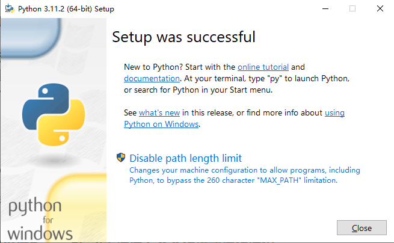
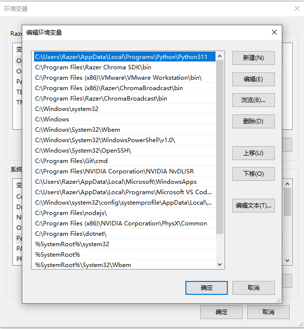

# 1. 安装Selenium
## 1.1. python
### 1.1.1. Windows
#### 1.1.1.1. 下载
[python](https://www.python.org/downloads/)

#### 1.1.1.2. 安装



- `disable path length limit`禁用系统的Path长度自动限制，能给我们避免很多的麻烦。

#### 1.1.1.3. 配置环境变量
如果勾选了`Add Python 3.X to PATH`可以不用手动配置环境变量



#### 1.1.1.4. 运行HelloWorld


## 1.2. pip 安装 selenium
使用pip来安装selenium:

```bash
pip install selenium
```

## 1.3. chrome-for-testingt
### 1.3.1. 最新版本
[Chrome for Testing ](https://googlechromelabs.github.io/chrome-for-testing/)

### 1.3.2. 历史版本
下载历史版本的chromedriver和chrome，根据[version](https://googlechromelabs.github.io/chrome-for-testing/known-good-versions.json)来替换下载链接中版本号进行下载。
