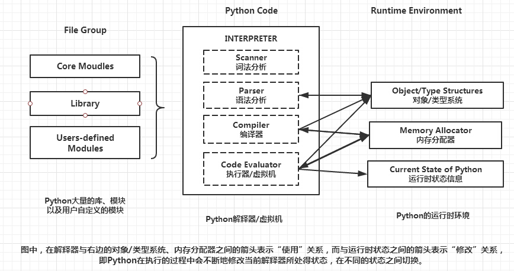

# 1. Python解释器
## 1.1. 种类
- CPython：官方版本的解释器。这个解释器是用C语言开发的，所以叫CPython。CPython是使用最广的Python解释器。我们通常说的、下载的、讨论的、使用的都是这个解释器。
- Ipython：基于CPython之上的一个交互式解释器，在交互方式上有所增强，执行Python代码的功能和CPython是完全一样的。CPython用>>>作为提示符，而IPython用In [序号]:作为提示符。
- PyPy：一个追求执行速度的Python解释器。采用JIT技术，对Python代码进行动态编译（注意，不是解释），可以显著提高Python代码的执行速度。绝大部分CPython代码都可以在PyPy下运行，但还是有一些不同的，这就导致相同的Python代码在两种解释器下执行可能会有不同的结果。
- Jython：运行在Java平台上的Python解释器，可以直接把Python代码编译成Java字节码执行。
- IronPython：和Jython类似，只不过IronPython是运行在微软.Net平台上的Python解释器，可以直接把Python代码编译成.Net的字节码。

## 1.2. Python 运行机制

编写的代码一般都会保存在以.py为后缀的文件中。在执行程序时，解释器逐行读取源代码并逐行解释运行。每执行一次，就重复一次这个过程，这其中耗费了大量的重复性的解释工作。为了减少这一重复性的解释工作，Python引入了pyc文件，pyc文件是将py文件的解释结果保存下来的文件，这样，下次再运行的时候就不用再解释了，直接使用pyc文件就可以了，这无疑大大提高了程序运行速度。

pyc文件：
- 对于当前调用的主程序不会生成pyc文件；
- 以import xxx或from xxx import xxx等方式导入主程序的模块才会生成pyc文件；
- 每次使用pyc文件时，都会根据pyc文件的创建时间和源模块进行对比，如果源模块有修改，则重新创建pyc文件，并覆盖先前的pyc文件，如果没有修改，直接使用pyc文件代替模块；
- pyc文件统一保存在模块所在目录的__pycache__文件夹内。