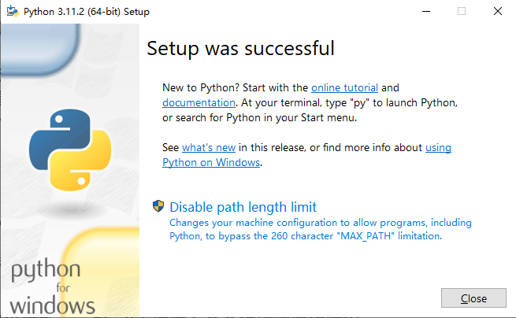
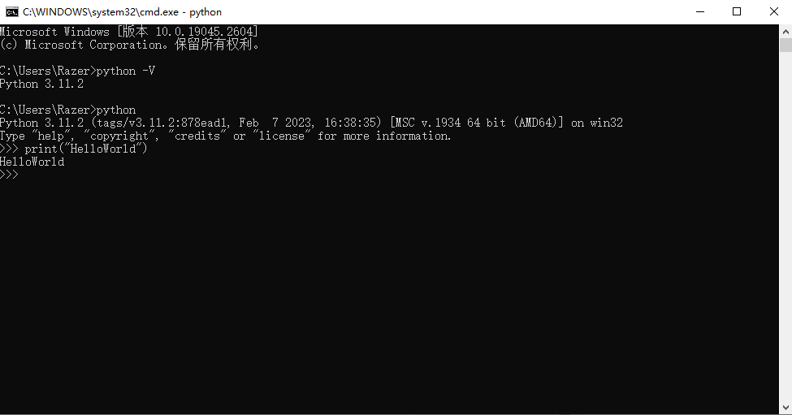

# 1. 搭建python环境
## 1.1. Windows
### 1.1.1. 下载
[python](https://www.python.org/downloads/)

### 1.1.2. 安装

- `disable path length limit`禁用系统的Path长度自动限制，能给我们避免很多的麻烦。

### 1.1.3. 配置环境变量
如果勾选了`Add Python 3.X to PATH`可以不用手动配置环境变量

### 1.1.4. 运行HelloWorld
