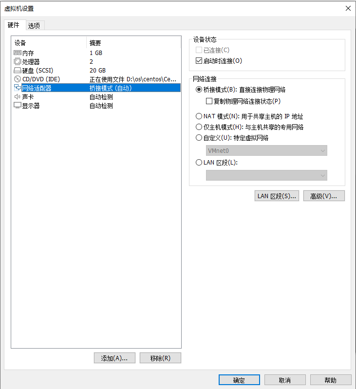

# 1. 使用ipxe自动安装centos
## 1.1. nginx
### 1.1.1. 添加yum repository
添加文件`/etc/yum.repos.d/nginx.repo`
```html
[nginx]
name=nginx repo
baseurl=https://nginx.org/packages/centos/$releasever/$basearch/
gpgcheck=0
enabled=1
```

### 1.1.2. 安装
使用以下命令：
```bash
sudo yum install nginx -y
```

### 1.1.3. 相关配置文件
配置文件路径：`/etc/nginx/conf.d/default.conf`

内容如下：
```conf
server {
    listen       80;
    server_name  localhost;

    #access_log  /var/log/nginx/host.access.log  main;

    location / {
        root   /usr/share/nginx/html;
        # root   /usr/share/nginx/html;
        index  index.html index.htm;
    }

    #error_page  404              /404.html;

    # redirect server error pages to the static page /50x.html
    #
    error_page   500 502 503 504  /50x.html;
    location = /50x.html {
        root   /usr/share/nginx/html;
    }

    # proxy the PHP scripts to Apache listening on 127.0.0.1:80
    #
    #location ~ \.php$ {
    #    proxy_pass   http://127.0.0.1;
    #}

    # pass the PHP scripts to FastCGI server listening on 127.0.0.1:9000
    #
    #location ~ \.php$ {
    #    root           html;
    #    fastcgi_pass   127.0.0.1:9000;
    #    fastcgi_index  index.php;
    #    fastcgi_param  SCRIPT_FILENAME  /scripts$fastcgi_script_name;
    #    include        fastcgi_params;
    #}

    # deny access to .htaccess files, if Apache's document root
    # concurs with nginx's one
    #
    #location ~ /\.ht {
    #    deny  all;
    #}
}
```

### 1.1.4. 启动nginx
使用以下命令：
```bash
sudo systemctl start nginx
```

## 1.2. dnsmasq
### 1.2.1. 安装
使用以下命令：
```bash
sudo yum install dnsmasq -y
```

### 1.2.2. 修改配置文件
修改配置文件`/etc/dnsmasq.conf`
```conf
no-daemon  #不作为守护进程，保持在前台，便于调试，正常使用时可去掉
dhcp-range=192.168.2.0,proxy #自己所在的需要代理的网段，192.168.2.0为局域网的网段
dhcp-boot=tag:!ipxe,undionly.kpxe,192.168.2.130 #如果不是ipxe固件发起的，则发送undionly.kpxe。192.168.2.130为本机的ip地址,可通过ip addr 命令进行查询本机ip地址
dhcp-match=set:ipxe,175 # gPXE/iPXE sends a 175 option.
dhcp-boot=tag:!ipxe,undionly.kpxe
dhcp-boot=http://192.168.2.130/menu.conf,192.168.2.130,192.168.2.130 #如果是ipxe发起的请求，则发送菜单链接，后边两个ip为ipxe服务器ip，也就是本机ip地址
pxe-service=tag:!ipxe,x86PC,"splash",undionly.kpxe #对所有的pxe请求做出响应，发送undionly.kcpxe
enable-tftp #开启tftp
tftp-root=/usr/share/nginx/html/  #设置tftp的根目录
log-queries  #打印所有dhcp请求，用于调试
conf-dir=/etc/dnsmasq.d  #包含的其他配置
```

## 1.3. ipxe
### 1.3.1. 下载
运行以下命令：
```bash
cd /usr/share/nginx/html/
sudo wget http://boot.ipxe.org/undionly.kpxe
```

### 1.3.2. menu.ipxe
新建文件`menu.ipxe`

```conf
#!ipxe

menu Steak's iPXE menu
item centos7-setup CentOS 7
item
item ipxeshell iPXE Shell

choose os && goto ${os}

:ipxeshell
shell

:centos7-setup
set base http://192.168.2.130/centos/7/x86_64      ## 本地镜像
#set base http://mirror.centos.org/centos/7/os/x86_64/  ## 网络镜像
prompt -k 0x197e -t 2000 Press F12 to install CentOS... || exit
kernel ${base}/images/pxeboot/vmlinuz initrd=initrd.img repo=${base}
initrd ${base}/images/pxeboot/initrd.img
boot || read void
```

### 1.3.3. 准备系统镜像
运行以下命令：
```bash
wget https://mirrors.aliyun.com/centos/7.4.1708/isos/x86_64/CentOS-7-x86_64-Minimal-1708.iso   ## 其他镜像源的也可以
mount CentOS-7-x86_64-Minimal-1708.iso /mnt   ## 镜像需要这一步操作
sudo mkdir -p /usr/share/nginx/html/centos/7/x86_64/
sudo cp -r /mnt/* /usr/share/nginx/html/centos/7/x86_64/
```

## 1.4. 目录结构
`/usr/share/nginx/html`路径下所有文件：

```bash
html
    ├── 50x.html
    ├── centos
    │   └── 7
    │       └── x86_64
    │           ├── CentOS_BuildTag
    │           ├── EFI
    │           ├── EULA
    │           ├── GPL
    │           ├── images
    │           │   ├── efiboot.img
    │           │   ├── pxeboot
    │           │   │   ├── initrd.img
    │           │   │   ├── TRANS.TBL
    │           │   │   └── vmlinuz
    │           │   └── TRANS.TBL
    │           ├── isolinux
    │           │   └── vmlinuz
    │           ├── LiveOS
    │           ├── Packages
    │           ├── repodata
    │           ├── RPM-GPG-KEY-CentOS-7
    │           ├── RPM-GPG-KEY-CentOS-Testing-7
    │           └── TRANS.TBL
    ├── index.html
    ├── ks.cfg
    ├── menu.ipxe
    ├── test.txt
    └── undionly.kpxe
```

## 1.5. 防火墙
使用以下命令：
```bash
sudo systemctl stop firewalld.service
```

## 1.6. 启动dnsmasq
使用以下命令：
```bash
cd /etc
sudo dnsmasq -C dnsmasq.conf
```

## 1.7. 网络
