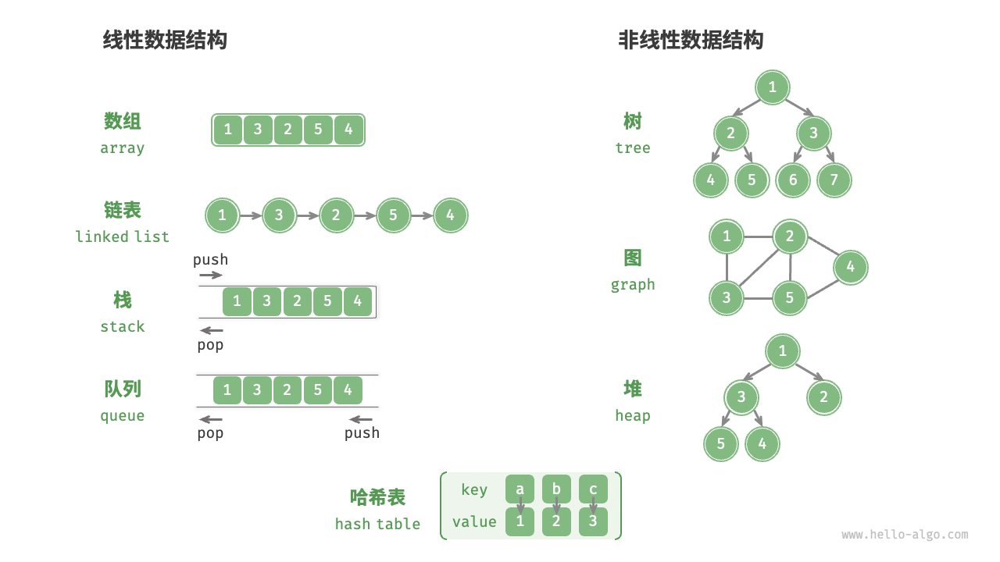
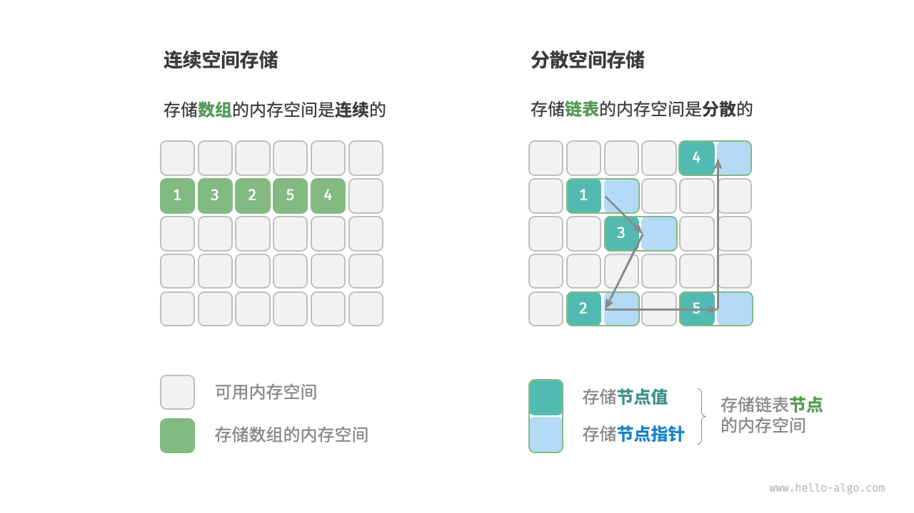
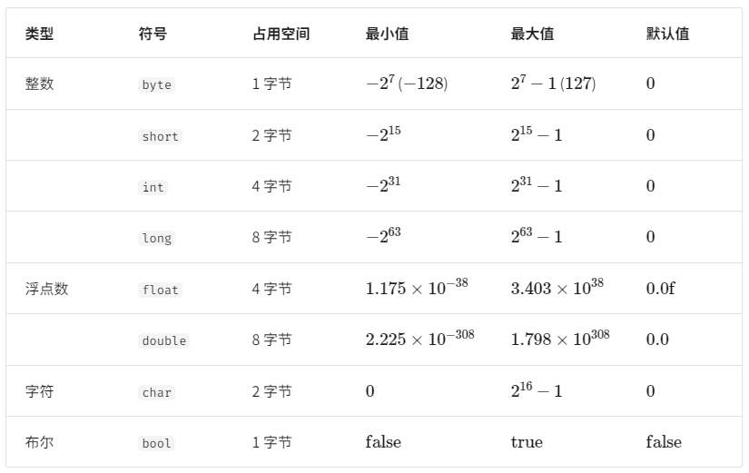
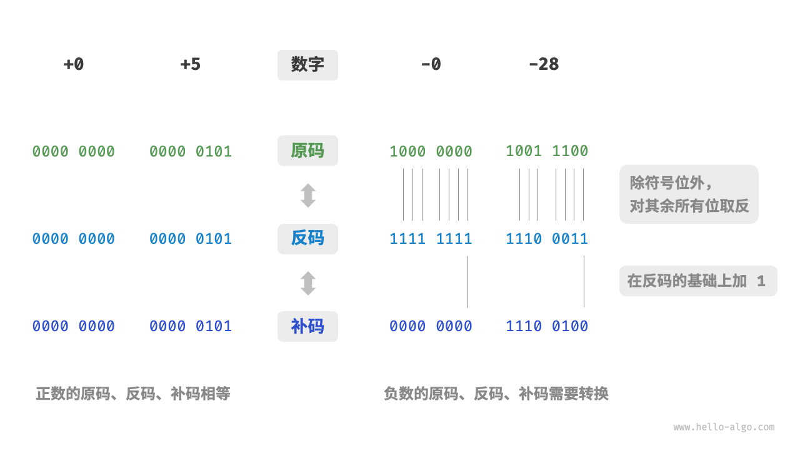
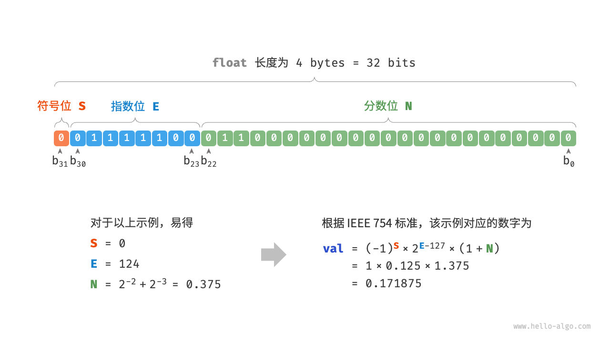
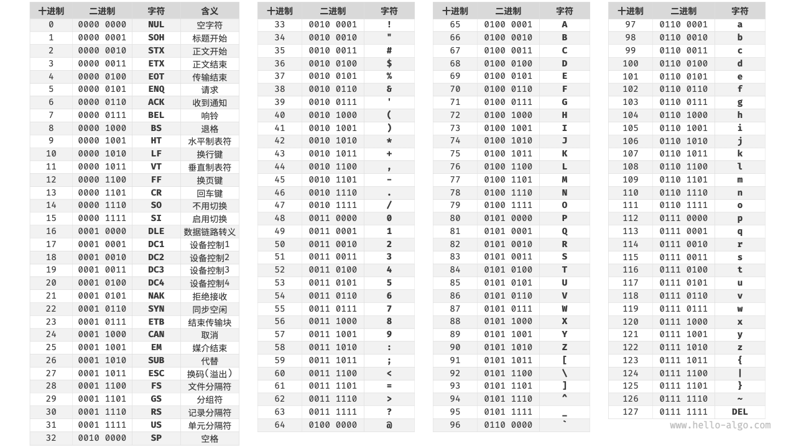
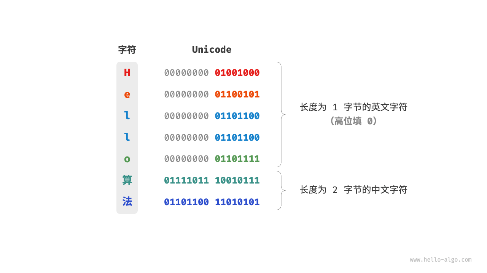
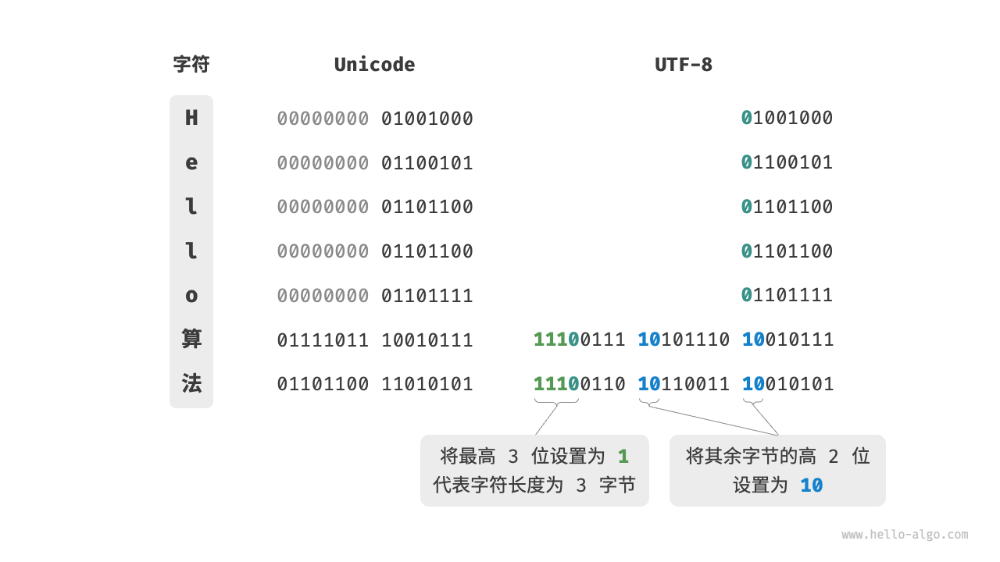

# 1. 数据结构

## 1.1. 数据结构分类
常见的数据结构包括数组、链表、栈、队列、哈希表、树、堆、图。

### 1.1.1. 逻辑结构

- 线性数据结构：数组、链表、栈、队列、哈希表，元素之间是一对一的顺序关系
- 非线性数据结构：树、堆、图、哈希表
- 树形结构：树、堆、哈希表，元素之间是一对多的关系
- 网状结构：图，元素之间是多对多的关系

### 1.1.2. 物理结构

所有数据结构都是基于数组、链表或二者的组合实现的。
- 基于数组可实现：栈、队列、哈希表、树、堆、图、矩阵、张量（维度>=3的数组）等
- 基于链表可实现：栈、队列、哈希表、树、堆、图等

## 1.2. 基本数据类型

## 1.3. 数字编码
### 1.3.1. 原码、反码和补码
- 原码：将数字的二进制表示的最高位视为符号位，其中0表示正数，1表示负数，其余位表示数字的值
- 反码：正数的反码与其原码相同，负数的反码是对其原码除符号位外的所有位取反
- 补码：正数的补码与其原码相同，负数的补码是在器反码的基础上加1

### 1.3.2. 浮点数编码

## 1.4. 字符编码
###  1.4.1. ASCII 字符集

### 1.4.2. GBK 字符集
GBK 字符集是在 GB2312 的基础上扩展得到的，它共收录了 21886 个汉字。在 GBK 的编码方案中，ASCII 字符使用一个字节表示，汉字使用两个字节表示。

### 1.4.3. Unicode 字符集

### 1.4.4. UTF-8 编码
