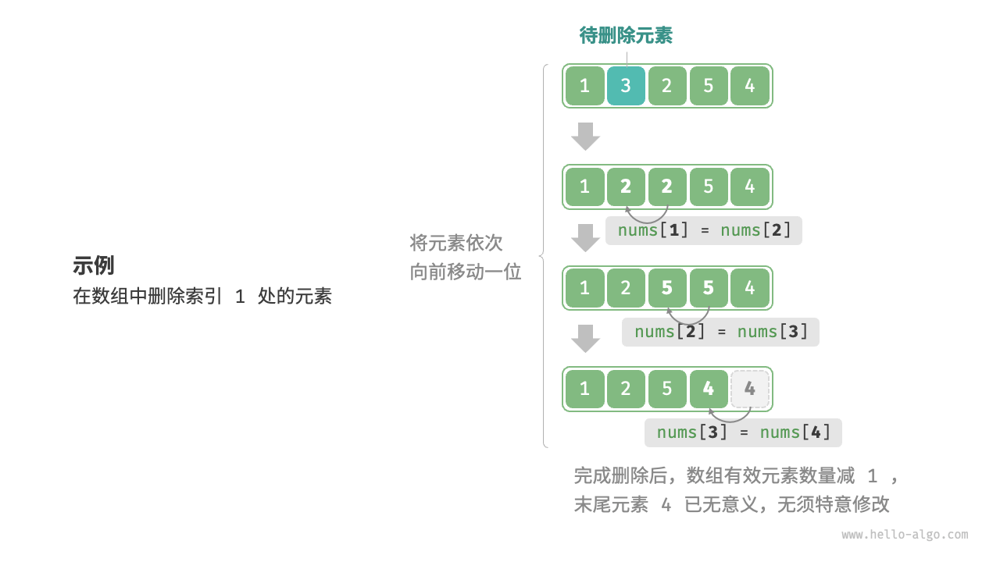
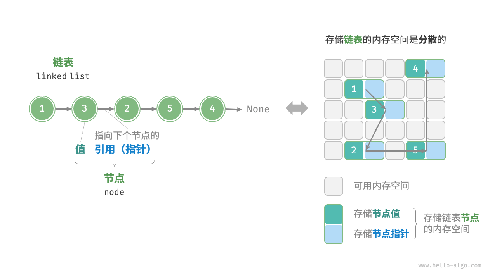

# 1. 数组与链表
## 1.1. 数组
>`数组（array）`是一种线性数据结构，其将相同类型的元素存储在连续的内存空间中。元素在数组中的位置称为该元素的`索引（index）`。


### 1.1.1. 数组常用操作
#### 1.1.1.1. 初始化数组
两种初始化数组方式：`无初始值`、`给定初始值`。

```java
/* 初始化数组 */
int[] arr = new int[5]; // { 0, 0, 0, 0, 0 }     # 在未指定初始值的情况下，大多数编程语言会将数组元素初始化为0
int[] nums = { 1, 3, 2, 5, 4 };
```

#### 1.1.1.2. 访问元素


```java
/* 随机访问元素 */
int randomAccess(int[] nums) {
    // 在区间 [0, nums.length) 中随机抽取一个数字
    int randomIndex = ThreadLocalRandom.current().nextInt(0, nums.length);
    // 获取并返回随机元素
    int randomNum = nums[randomIndex];
    return randomNum;
}
```

#### 1.1.1.3. 插入元素


```java
/* 在数组的索引 index 处插入元素 num */
void insert(int[] nums, int num, int index) {
    // 把索引 index 以及之后的所有元素向后移动一位
    for (int i = nums.length - 1; i > index; i--) {
        nums[i] = nums[i - 1];
    }
    // 将 num 赋给 index 处的元素
    nums[index] = num;
}
```

#### 1.1.1.4. 删除元素


```java

```

#### 1.1.1.5. 遍历数组
```java
/* 遍历数组 */
void traverse(int[] nums) {
    int count = 0;
    // 通过索引遍历数组
    for (int i = 0; i < nums.length; i++) {
        count += nums[i];
    }
    // 直接遍历数组元素
    for (int num : nums) {
        count += num;
    }
}
```

#### 1.1.1.6. 查找元素
在数组中查找指定元素需要遍历数组，每轮判断元素值是否匹配，若匹配则输出对应索引。
因为数组是线性数据结构，所以上述查找操作被称为“线性查找”。

```java
/* 在数组中查找指定元素 */
int find(int[] nums, int target) {
    for (int i = 0; i < nums.length; i++) {
        if (nums[i] == target)
            return i;
    }
    return -1;
}
```

#### 1.1.1.7. 扩容数组
在复杂的系统环境中，程序难以保证数组之后的内存空间是可用的，从而无法安全地扩展数组容量。因此在大多数编程语言中，数组的长度是不可变的。
如果我们希望扩容数组，则需重新建立一个更大的数组，然后把原数组元素依次复制到新数组。这是一个O(n)的操作，在数组很大的情况下非常耗时。

```java
/* 扩展数组长度 */
int[] extend(int[] nums, int enlarge) {
    // 初始化一个扩展长度后的数组
    int[] res = new int[nums.length + enlarge];
    // 将原数组中的所有元素复制到新数组
    for (int i = 0; i < nums.length; i++) {
        res[i] = nums[i];
    }
    // 返回扩展后的新数组
    return res;
}
```

## 1.2. 链表
链表（linked list）是一种线性数据结构，其中的每个元素都是一个节点对象，各个节点通过“引用”相连接，引用记录了下一个节点的内存地址，通过它可以从当前节点访问到下一个节点。链表的设计使得各个节点可以分散存储在内存各处，它们的内存地址无需连续。



### 1.2.1. 链表常用操作
#### 1.2.1.1. 初始化链表
建立链表分为两步，第一步是初始化各个节点对象，第二步是构建节点之间的引用关系。初始化完成后，我们就可以从链表的头节点出发，通过引用指向 next 依次访问所有节点。

```java
/* 初始化链表 1 -> 3 -> 2 -> 5 -> 4 */
// 初始化各个节点
ListNode n0 = new ListNode(1);
ListNode n1 = new ListNode(3);
ListNode n2 = new ListNode(2);
ListNode n3 = new ListNode(5);
ListNode n4 = new ListNode(4);
// 构建节点之间的引用
n0.next = n1;
n1.next = n2;
n2.next = n3;
n3.next = n4;
```

#### 1.2.1.2. 插入节点


```java
/* 在链表的节点 n0 之后插入节点 P */
void insert(ListNode n0, ListNode P) {
    ListNode n1 = n0.next;
    P.next = n1;
    n0.next = P;
}
```

#### 1.2.1.3. 删除节点


```java
/* 删除链表的节点 n0 之后的首个节点 */
void remove(ListNode n0) {
    if (n0.next == null)
        return;
    // n0 -> P -> n1
    ListNode P = n0.next;
    ListNode n1 = P.next;
    n0.next = n1;
}
```

#### 1.2.1.4. 访问节点
访问链表的第i个节点需要循环i-1轮，时间复杂度为O(n)。

```java
/* 访问链表中索引为 index 的节点 */
ListNode access(ListNode head, int index) {
    for (int i = 0; i < index; i++) {
        if (head == null)
            return null;
        head = head.next;
    }
    return head;
}
```

#### 1.2.1.5. 查找节点
```java
/* 在链表中查找值为 target 的首个节点 */
int find(ListNode head, int target) {
    int index = 0;
    while (head != null) {
        if (head.val == target)
            return index;
        head = head.next;
        index++;
    }
    return -1;
}
```

### 1.2.2. 常见的链表类型
- 单向链表：单向链表的节点包含值和指向下一节点的引用两项数据。我们将首个节点称为头节点，将最后一个节点称为尾节点，尾节点指向空 None 。
- 环形链表：如果我们令单向链表的尾节点指向头节点（首尾相接），则得到一个环形链表。在环形链表中，任意节点都可以视作头节点。
- 双向链表：与单向链表相比，双向链表记录了两个方向的引用。双向链表的节点定义同时包含指向后继节点（下一个节点）和前驱节点（上一个节点）的引用（指针）。相较于单向链表，双向链表更具灵活性，可以朝两个方向遍历链表，但相应地也需要占用更多的内存空间。


## 1.3. 列表
列表（list）是一个抽象的数据结构概念，它表示元素的有序集合，支持元素访问、修改、添加、删除和遍历等操作，无须使用者考虑容量限制的问题。列表可以基于链表或数组实现。

### 1.3.1. 列表常用操作
#### 1.3.1.1. 初始化列表
两种初始化方法：无初始值和有初始值。

```java
/* 初始化列表 */
// 无初始值
List<Integer> nums1 = new ArrayList<>();
// 有初始值（注意数组的元素类型需为 int[] 的包装类 Integer[]）
Integer[] numbers = new Integer[] { 1, 3, 2, 5, 4 };
List<Integer> nums = new ArrayList<>(Arrays.asList(numbers));
```

#### 1.3.1.2. 访问元素
```java
/* 访问元素 */
int num = nums.get(1);  // 访问索引 1 处的元素

/* 更新元素 */
nums.set(1, 0);  // 将索引 1 处的元素更新为 0
```

#### 1.3.1.3. 插入与删除元素
```java
/* 清空列表 */
nums.clear();

/* 在尾部添加元素 */
nums.add(1);
nums.add(3);
nums.add(2);
nums.add(5);
nums.add(4);

/* 在中间插入元素 */
nums.add(3, 6);  // 在索引 3 处插入数字 6

/* 删除元素 */
nums.remove(3);  // 删除索引 3 处的元素
```

#### 1.3.1.4. 遍历列表
```java
/* 通过索引遍历列表 */
int count = 0;
for (int i = 0; i < nums.size(); i++) {
    count += nums.get(i);
}

/* 直接遍历列表元素 */
for (int num : nums) {
    count += num;
}
```

#### 1.3.1.5. 拼接列表
```java
/* 拼接两个列表 */
List<Integer> nums1 = new ArrayList<>(Arrays.asList(new Integer[] { 6, 8, 7, 10, 9 }));
nums.addAll(nums1);  // 将列表 nums1 拼接到 nums 之后
```

#### 1.3.1.6. 排序列表
```java
/* 排序列表 */
Collections.sort(nums);  // 排序后，列表元素从小到大排列
```